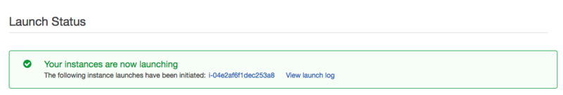
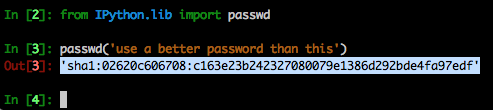

**Foreword**

This step-by-step tutorial to set up and use Jupyter Notebook on Amazon Web Services (AWS) Elastic Compute Cloud (EC2) for machine learning [from DataCamp](https://www.datacamp.com/community/tutorials/deep-learning-jupyter-aws)

Also, to find out more about AWS EC2 and a data science environment on a Windows instance, consult [this article from DataCamp](https://www.datacamp.com/community/tutorials/aws-ec2-beginner-tutorial).

---

Among the services:

- Amazon EC2;
- Amazon QuickSight;
- Amazon RDS;
- AWS Lambda.

- You can learn how to launch a virtual machine, create a web app, connect an IoT card, register a domain, etc.
- There are [tutorial videos](https://aws.amazon.com/getting-started/use-cases/) and workshops for web sites (host, node.js web app, Python web app, etc.), DevOps (CI/CD Pipeline, repos, etc.), Big Data (Hadoop+Hive, ML, log analytics solution pipeline), databases, wireless, etc.

For a deeper understanding of AWS EC2:

# Getting an Amazon Web Services Account

On the [Amazon Web Services](https://aws.amazon.com/) or in [French]([Amazon Web Services](https://aws.amazon.com/fr/), click on "Sign In to the Console".  
Sign in if you have account.  
If you don't, you will need to make one.

# Setting Up a Cloud Computing Server

Amazon offers an enormous range of cloud computing services.  
Pick EC2 service (short for Elastic Cloud Compute). The upper left part of your browser window offers a menu for services.  
Open this menu and select EC2, which should be the first option. This brings you to a page with information about status of all EC2 computing instances you have running. Select the button in the middle of this page to Launch Instance.  
Each computing instance comes preloaded with different software (in “machine images”), and we need to decide what we want preloaded. In our case, we want to use an image from the AWS Marketplace that is optimized for deep learning.  
Select AWS Marketplace on the left menu bar. Then enter "deep learning ubuntu" in the search space.  
This will bring up some options including Amazon’s official "Deep Learning AMI (Ubuntu)" (Version 14.0 or higher). Or select it from the Quick Launch left menu bar.  
You will now be presented with a menu of instance types. Each instance type has a different price, and a different computational capabilities.  
The instances with GPU’s are those that start with either g2 or p2. We recommend the «p2.xlarge», which costs a little less than a dollar an hour. If you want something less expensive, the «g2.2xlarge» is about $0.65/hr, though it isn’t quite as fast or as powerful.  
After you have selected your instance type, select Configure Instance Details at the bottom of the page. Then select 6. Configure Security Group on the menu towards the top of the page.  
Here, we will set up your instance to make it easy to access from your computer. Each row describes rules for how one can access your instance. We will use Jupyter notebooks, which are served on port 8888. If you don’t understand this yet, you will see how to make it work soon.  
For now, click the Add Rule button. In the new column select TCP for the protocol, 8888 for the Port, and 0.0.0.0/0 for the last column, which is the source.

Finally click the Review and Launch button on the bottom of your screen. Then press Launch again.  
You will now get to the last bit of security… which is selecting a key pair. The key is a file you have on your computer, which must match a file stored on the server. This is how you prevent others from using the server you just set up. So, don’t share keys with others or put the file anywhere public.  
Select Create a new key pair (or choose an existing pair) and type in a name for your key («CloudAWSTutorial.pem»). Then press the Download Key Pair button to get a copy of your key, which you will need to access your server.  
You will soon be brought to a screen that looks like what you this:

The long string of characters in blue is the name of your instance. You can select that to see your EC2 dashboard, which shows this server running.

# Connecting to Your Server

We will now connect to our server using a protocol called ssh. From there, we will start a Jupyter notebook server, which we can use through the browser.  
On a Mac or Linux computer, you can use the ssh command.  
In Windows, many people use an application called PuTTY for ssh connections.  
You may need to change the access priveleges for the file for your key. In MacOS and Linux this can be done with the command: `chmod 400 my_private_key.pem`.  
Then, still at the command line, specify that you want this key to be available for authentication when logging into your server with: `ssh-add my_private_key.pem`.  
To log into our server, we will need the servers IP address. This can be found in the EC2 dashboard in your browser. Copy it...  
Log into this at the command line with the command: `ssh ubuntu@18.219.71.98`. You will want to replace 18.219.71.98 with your server’s IP address.  
Once logged into your server, use the `ipython` command to start an IPython shell.  
Once in IPython, try importing keras (or another package) to ensure everything works. You will see some message indicating the CUDA is being used... which mean keras is accessing the GPU.  
If you are comfortable with Linux, IPython, and a Linux text editor, you can work from here. Some people choose to use two windows. One to ssh to my server and use IPython, and another to ssh to the server and use the text editor.

# Setting up Your Jupyter Notebook

However, most people will find it easier to set up Jupyter notebooks and program through the browser. For this, we will want to set up a new password.  
The first step is to get the hash of whatever password you want to use. You do that with the following in IPython:

    from IPython.lib import passwd
    
    passwd('use a better password than this')

Copy the hash that is output after you set your password. You will need that again in a moment.  
Type `exit` to get out of IPython (back in the virtual terminal).

Then use a text editor to edit ~/.jupyter/jupyter_notebook_config.py. Use the command: `nano ~/.jupyter/jupyter_notebook_config.py`.  
At the top of that file, paste the following. You can copy all of this exactly, and just replace the password. Remember, don’t use your actual password. Copy in the hash of your password that you created earlier:

    c = get_config()
    c.IPKernelApp.pylab = 'inline'
    c.NotebookApp.certfile = u'/home/ubuntu/certs/mycert.pem'
    c.NotebookApp.ip = '*'
    c.NotebookApp.open_browser = False
    
    c.NotebookApp.password = u'sha1:a9985e250966:a1401151cca1771a9fbc88d276fde3482330aa93' 
    c.NotebookApp.port = 8888
    
Exit and save the file.

# Connecting to Jupyter in the Browser

Go to the browser of your choice, and enter the address of your instance (available in the EC2 dashboard) followed by :8888.  
You may see a security message at this point. You shouldn’t need to worry about this.  
In Chrome, you can click an “advanced” button in your main browser window to bypass this security message.  
You will now be prompted for your password.  
Type in your password. This is not the hash of your password, but rather the raw password that you previously typed into IPython to get the hash value.  
Congrats, you are logged in!

# Using The Notebook

From within the browser, select on the menu to create a new Jupyter notebook.  
Getting these notebook capabilities required a lot of setup.   Fortunately, it’s mostly a 1-time effort.  
You can now **stop** your server in the EC2 dashboard whenever you aren’t using it, and you will stop paying for it.  
Stopping an instance will keep all of your setup effort, but the instance will stop working until you restart it.  
In some ways, this is like a pause button.  
If you selected terminate it would lose all information about that instance, and you would have to redo the setup next time.  
Since you selected stop, you can now go back to the ec2 dashboard on another day and click start.  
Once you click start, it’s pretty easy to get up and running again.  
Your instance will get a new IP address.  
You will need to ssh into that new IP address.  
You can then go back to your browser, and immediately start working again.
