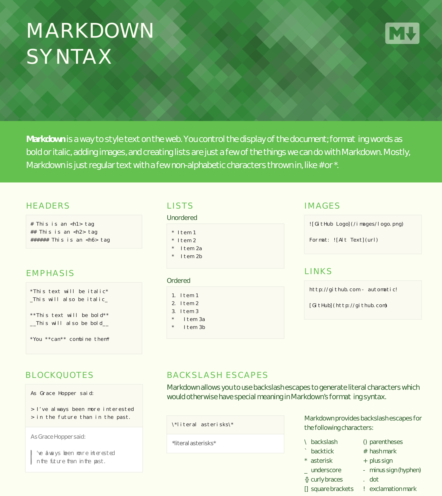
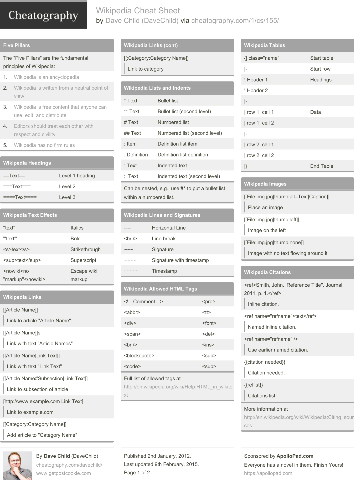
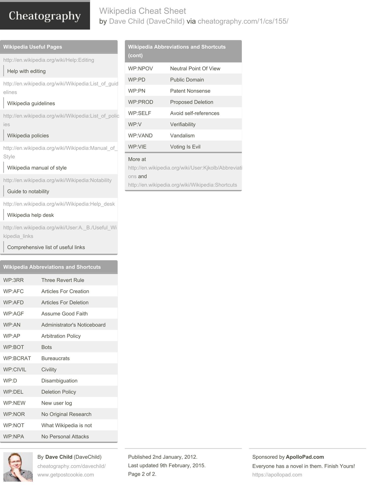
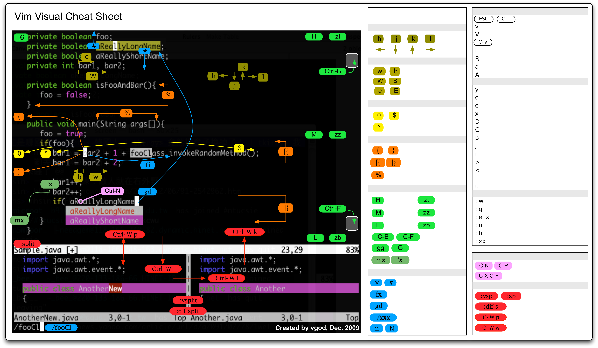

---

[TOC]

---

**Foreword**

Cheat sheets.

---

## Markdown

- [GitHub Markdown Syntax](markdown-cheatsheet-online.pdf). PDF.

## Tableau

- [Tableau Cheat Sheet](Tableau_Cheat_Sheet.pdf). PDF only.

## Git

### Principal commands

- `git init`: creates a new Git repository.
- `git status`: inspects the contents of the working directory and staging area.
- `git add <filename_1> <filename_2>`: adds files from the working directory to the staging area.
- `git add .`, `git add --all`.
- `git diff <filename_1> <filename_2>`: shows the difference between the working directory and the staging area.
- `git commit -m "<comments>"`: permanently stores file changes from the staging area in the repository.
- `git log`: shows a lis t of all previous commits.
- `git show HEAD`: show the most recent commit.
- `git checkout HEAD <filename_1> <filename_2>`: discards changes in the working directory.
- `git checkout <filename_1> <filename_2>`: idem.
- `git reset HEAD <filename_1> <filename_2>`: unstages file changes in the staging area, restore the file in your working directory.
- `git reset <SHA> (7 characters)`: can be used to reset to a previous commit in your commit history.
- `git branch`: lists all a Git project's branches.
- `git branch <branch_name>`: creates a new branch.
- `git checkout <branch_name>`: used to switch from one branch to another (the branch_name).
- `git merge <branch_name>`: used to join file changes from one branch to another (your in branch A, you merge branch_name with A).
- `git branch -d <branch_name>`: deletes the branch specified.
- `git clone <remote_location> <clone_name>`: creates a local copy of a remote.
- `git remote -v`: lists a Git project's remotes.
- `git fetch`: fetches work from the remote into the local copy (no merging).
- `git merge origin/master`: Merges origin/master into your local branch.
- `git push origin <branch_name>`: pushes a local branch to the origin remote.

---

- [Git Cheat Sheet](git-cheat-sheet.pdf). PDF.

---

- [Git Cheat Sheet](git-cheatsheet-EN-white.pdf). PDF.

---

- [Git Cheat Sheet](github-git-cheat-sheet.pdf). PDF.

## Wikipedia

- [Wikipedia Syntax](davechild_wikipedia.pdf). PDF.

## LaTeX

- [LaTeX Font Packages](latex-font-packages.pdf). PDF only.
- [LaTeX Cheat Sheet 4p](latexcheatsheet_1.pdf). PDF only.
- [LaTeX Cheat Sheet 2p](latexsheet.pdf). PDF.

---

## Vi/Vim

- [Vi Editor](viEditorCheatSheet.pdf). PDF.

---

- [Vim Visual](vim-cheat-sheet-en.pdf). PDF.

## Regex

- [Regex](davechild_regular-expressions.pdf). PDF.

