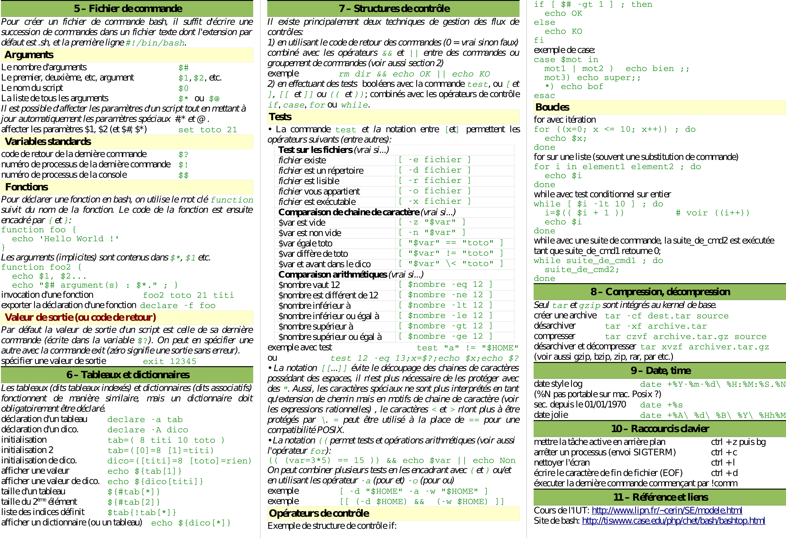

<!--
---

[TOC]
-->
---

**Foreword**

Cheat sheets.

---

# Linux

- [Ubuntu Reference](Ubuntu_Ref.pdf). PDF.

---

- [Linux Command Reference](Unix-Linux-Command-Reference.pdf). PDF.

---

- [Linux Command Line](davechild_linux-command-line.pdf). PDF.

---

- [Mémo Console UNIX](GuideCommandesShellv4).

---

- [Learning the Shell](http://www.linuxcommand.org/lc3_learning_the_shell.php).
- [bc - An arbitrary precision calculator language](http://x-bc.sourceforge.net/man_bc.html).

# Windows

- [PowerShell Basics](powershell-basic-cheat-sheet2.pdf). PDF.

---

- [Windows PowerShell](PowerShellCheatSheet.pdf). PDF.

