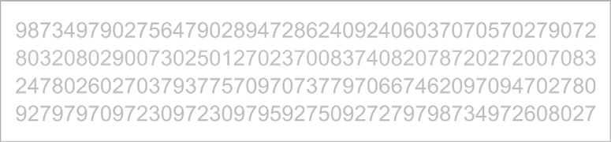
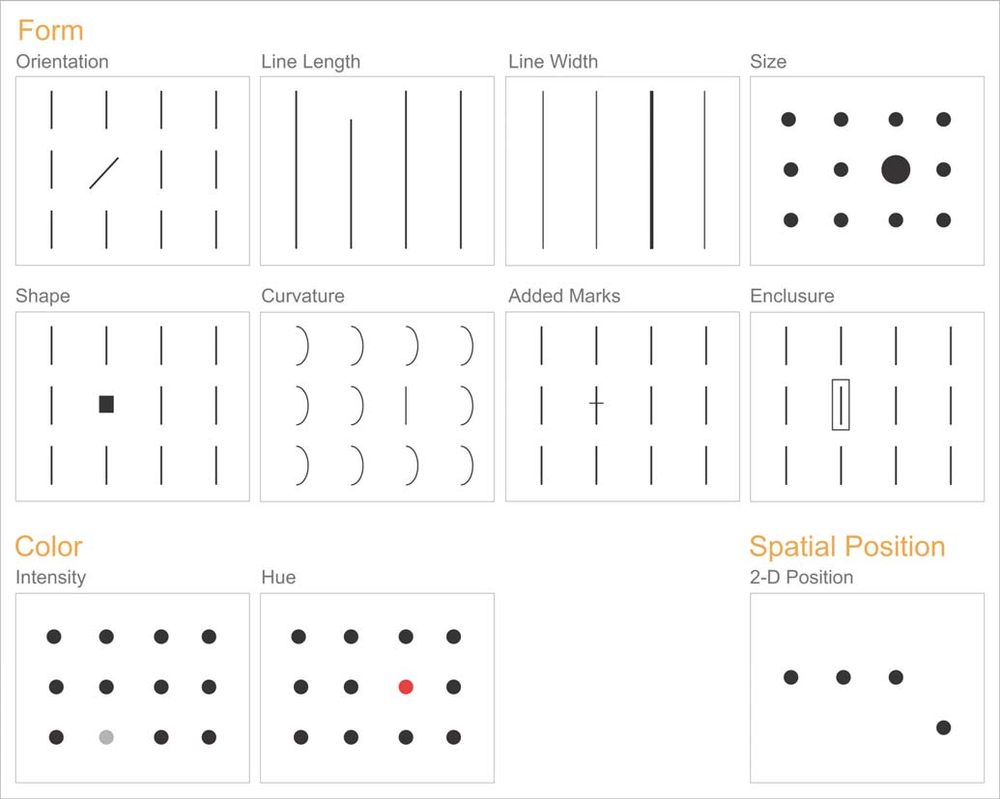

<!--

-->

---
**Foreword**

Notes. A summary from [this article](visual_perception.pdf).

---

# From Light to Thought

We don't actually see physical objects; we see light, either emitted by objects or reflected off of their surfaces.

# Role and Limitations of Memory

Our brains use various types of storage to hold information while it's
being processed and, in some cases, to store it for later use.

A common problem in graph design: the meaning of the nine separate data sets — represented by the nine differently colored lines — can't be concurrently held in short-term memory. The readers are forced to shift attention back and forth between the legend and the lines of data to remind themselves over and over what each line represents.

If you want someone to make sense of the graph as a whole, then you must limit the number of data components that encode distinct meanings to **seven at most** — and safer yet, to **no more than five**.

# Fundamental Attributes of Sight

The visual differences between the shapes of the various numbers that appear in the figure below are too complex to process preattentively.

To count all the 5's involves serial attentive processing.

Now count the 5's in the same set of numbers in the figure below.

This time perception was easy and immediate, because the 5's were encoded with a different preattentive visual attribute from the other numbers. If you want some of the data to stand out from the rest, you should encode it **using different preattentive attributes**.  
Here's a list of the preattentive attributes that are of particular use in visual displays of data:

**Color intensity**, such as different shades of gray ranging from white to black (that is, "grayscale") can be quantitatively perceived to a degree—by making one value darker, for example, we can tell that it is **greater than another**, but not well enough to decode specific shades into specific values without a lot of work.  
Attributes that can't be perceived quantitatively can still be used in graphs, but their use is restricted to **distinguishing categorical differences**, such as the use of hue to distinguish different lines in a line graph, sets of bars in a bar graph, or sets of points in a scatter plot.

# Thriving With Information

The better you understand the strengths and weaknesses of visual perception, the better equipped you'll be to make use of your **readers' abilities to detect structure and patterns in data** when it's visually displayed.

# Core Principles (recap)

# Core Principles (best practices)

